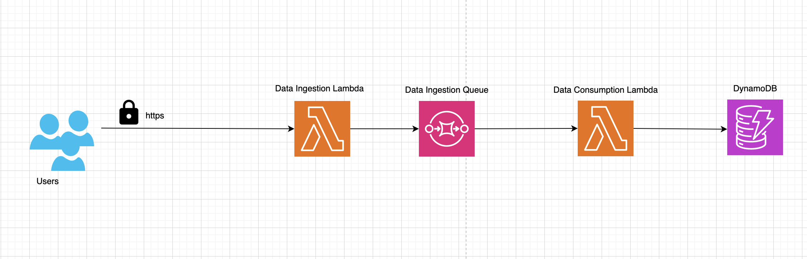

# serverless-data-ingestion

A repository containing a serverless application for data ingestion using AWS Lambda, DynamoDB, and SQS.

## Overview

This project demonstrates a serverless data ingestion pipeline that utilizes AWS Lambda for processing, DynamoDB for data storage, and SQS for message queuing. The application is designed to ingest data through an API, process it, and store it in a DynamoDB table.

### System Architect



## Features

- **API Gateway**: Exposes an HTTP endpoint for data ingestion.
- **Lambda Functions**: Processes the incoming data and stores it in DynamoDB.
- **DynamoDB**: Serves as the database for storing ingested data.
- **SQS**: Queues messages for processing, ensuring scalability and resilience.

## Requirements

- Node.js (version mentioned in `package.json`)
- AWS CLI configured with appropriate credentials
- AWS CDK for deploying the infrastructure

## Setup and Deployment

1. Clone the repository and navigate into the project directory:

```bash
git clone <repository-url>
cd serverless-data-ingestion
```

2. Install dependencies:

```bash
npm install
```

3. Deploy the stack using AWS CDK:

```bash
cdk deploy
```

## Environment Variables

Ensure the following environment variables are set in your `.env` file or in your deployment environment:

- `CDK_DEPLOY_REGIONS`: Specifies the AWS regions for deployment.
- `ENVIRONMENTS`: Specifies the environments (e.g., `dev`, `prod`) for the deployment.
- `APP_NAME`: Name of the application.
- `DATA_INGESTION_API_KEY`: API key for securing the data ingestion endpoint.

## Architecture

The application consists of the following main components:

- **Data Ingestion Lambda**: Handles incoming requests from API Gateway, validates the API key, and enqueues messages in SQS.
- **Data Processing Lambda**: Consumes messages from SQS, processes the data, and stores it in DynamoDB.
- **DynamoDB Table**: Stores the processed data, with configurations for encryption and backup.

## Contributing

Contributions are welcome! Please read the `CONTRIBUTING.md` file for guidelines on how to contribute to this project.

## License

This project is licensed under the MIT License - see the `LICENSE` file for details.
